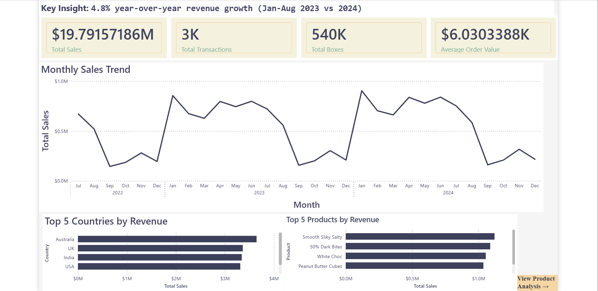

# 🍫 Chocolate Sales Analysis Dashboard

**Interactive Power BI dashboard analyzing sales performance with advanced drill-through features**

---

## 📊 Project Overview

This project demonstrates end-to-end business intelligence skills through comprehensive analysis of chocolate sales data spanning January 2022 to August 2024. The dashboard provides executives with actionable insights into sales performance, product portfolio health, and regional trends.

### Business Context
Analyzed **3,282 sales transactions** totaling **$19.8M** in revenue across **22 products** and **6 countries** to identify:
- 4.8% year-over-year revenue growth trends
- Top performing products and geographic markets
- Seasonal sales patterns and demand forecasting
- Product portfolio optimization opportunities

---

## 🎯 Key Features

### 📈 Executive Summary Page
- **KPI Cards:** Total Sales ($19.8M), Transactions (3.3K), Volume (540K boxes), Average Order Value ($6K)
- **Monthly Trend Analysis:** Time-series visualization revealing seasonal patterns across 2022-2024
- **Top 5 Rankings:** Countries and products by revenue contribution with visual comparisons
- **Business Insights:** Data-driven recommendations for stakeholders
- **Interactive Navigation:** One-click button to drill into product analysis

### 📦 Product Performance Analysis
- **Interactive Matrix:** All 22 products with conditional formatting (green gradient = high performers, red = needs attention)
- **Product Mix Donut Chart:** Revenue contribution analysis showing top 10 products
- **Portfolio Metrics:** Product-level KPIs including sales volume, average order value, and total boxes shipped
- **Right-click Drill-Through:** Click any product for detailed analysis page

### 🔍 Product Detail Drill-Through
- **Dynamic Filtering:** Automatic filtering to selected product with context retention
- **Deep-Dive Charts:** Monthly sales trends, top salespeople performance, regional breakdowns
- **Performance Metrics:** Product-specific KPIs (sales, volume, average order)
- **Navigation:** One-click return button to main dashboard

---

## 🛠️ Technical Skills Demonstrated

### Data Preparation & Modeling
- ✅ Power Query data validation and profiling (column quality, distribution analysis)
- ✅ Calendar table creation for time intelligence with Year, Quarter, Month, MonthNumber columns
- ✅ data modeling with one-to-many relationships
- ✅ Data quality checks (3,282 valid transactions, no nulls in key fields)
- ✅ Custom sort order implementation (MonthNumber for chronological ordering)

### DAX & Calculations
- ✅ Time intelligence measures (Previous Year Sales, YoY Growth%)
- ✅ Aggregation functions (SUM, AVERAGE, COUNTROWS, DISTINCTCOUNT)
- ✅ Context-aware calculations using CALCULATE and filter context
- ✅ Top N analysis using TOPN, ALL, and VALUES functions
- ✅ Conditional measures for dynamic KPI selection

### Visualization & UX
- ✅ Conditional formatting with multi-color gradient (green-yellow-red spectrum)
- ✅ Interactive drill-through pages with automatic back button
- ✅ Custom navigation buttons with page routing actions
- ✅ Professional theme design with consistent color palette

### Advanced Features
- ✅ Cross-page filtering and drill-through configuration
- ✅ Dynamic filtering based on product selection
- ✅ Sort by custom columns (MonthNumber for proper month ordering)
- ✅ Professional alignment and spacing using snap-to-grid

---

## 📈 Key Business Insights

1. **Steady Growth Trajectory:** 4.8% year-over-year revenue growth (Jan-Aug 2023 vs 2024) demonstrates consistent business expansion with opportunities for acceleration through targeted initiatives

2. **Balanced Market Distribution:** Australia (18.4%), UK (17.0%), and India (16.9%) lead revenue generation with 52% of total sales, while maintaining healthy diversification across 6 countries reduces geographic concentration risk

3. **Strong Portfolio Diversification:** Top 5 products contribute 27% of revenue, indicating healthy distribution rather than over-reliance on few SKUs. All 22 products demonstrate market viability

4. **Seasonal Demand Pattern:** Q1 drives 38% of annual sales with January peak ($2.9M), strongly suggesting Valentine's Day chocolate demand - opportunity for targeted marketing campaigns in Dec-Jan

5. **B2B Sales Model:** Average order value of $6,030 with 540K boxes shipped across 3,282 transactions indicates wholesale/distribution model rather than direct-to-consumer, suggesting bulk business relationships

6. **Product Performance Range:** Revenue spread from $677K (70% Dark Bites) to $1.1M (Smooth Silky Salty) shows even bottom performers contribute meaningfully (19% total), validating full product range strategy

---

## 📸 Dashboard Previews

### Executive Summary
*Comprehensive overview with KPIs, trends, and top performer rankings*

### Product Performance Matrix
*Interactive table with conditional formatting and revenue share analysis*

### Interactive Drill-Through
*Detailed product analysis with monthly trends and regional breakdowns*

---

## 📂 Repository Structure

Chocolate-Sales-Dashboard/
│
├── Chocolate_Sales_Dashboard_Portfolio.pbix # Main Power BI Dashboard File
├── Data/
│ └── Chocolate-Sales-2.csv # Raw data source (3,282 records)
├── Images/
│ ├── Executive_Summary.png
│ ├── Product_Performance.png
│ └── Product_Detail_Drillthrough.png
└── README.md # Project documentation

---

## 🚀 How to Use This Dashboard

### View & Interact
1. **Download:** Click the `.pbix` file above and download to your computer
2. **Open:** Install [Power BI Desktop](https://powerbi.microsoft.com/desktop/) (free) and open the file
3. **Explore:** Dashboard is fully interactive - no additional setup required!

### Key Interactions
- **Filter by Year:** Use the Year slicer to view 2022, 2023, or 2024 data
- **Navigate Pages:** Click "View Product Analysis →" button on Executive Summary to jump to Product Performance page
- **Drill-Through:** Right-click any product in the matrix → Select "Drill through" → "Product Detail Drill-Through" to see detailed analysis
- **Return:** Use the back arrow button (top-left) to return to previous page
- **Hover for Details:** Hover over any visual to see detailed tooltips with exact values

---

## 💡 Problem-Solving Highlights

### Challenges Solved During Development:

 **Date Hierarchy Ordering:** Months sorting alphabetically (Apr, Aug, Dec) instead of chronologically
   - **Solution:** Created MonthNumber column (1-12) and set "Sort by Column" property to fix ordering

 **Conditional Formatting:** Needed intuitive visual indicators for product performance without overwhelming users
   - **Solution:** Implemented green-to-red gradient based on sales values, providing instant visual insights

---

## 💼 Skills & Tools

**Business Intelligence:** Power BI Desktop, Data Visualization  
**Data Analysis:** DAX (Data Analysis Expressions), Power Query (M language)  
**Data Modeling:** relationships, calculated tables, time intelligence  
**Advanced Features:** Drill-through, conditional formatting, interactive navigation, dynamic filtering  
**Business Acumen:** KPI selection, executive storytelling, insight generation, portfolio analysis  

---

## 🎓 Learning & Development

This project was built as part of my data analyst portfolio to demonstrate:
- End-to-end dashboard development from raw data to polished deliverable
- Problem-solving skills when encountering technical challenges
- Ability to extract actionable business insights from data
- Professional presentation standards for executive audiences
- Self-directed learning and technical skill development

**Time Investment:** ~1 day from concept to completion  
**Key Learnings:** Date hierarchy management, drill-through configuration, conditional formatting best practices

---

## 📬 Contact & Connect

**[Muralidhara]**  
📧 Email: murali272004@gmail.com
💼 LinkedIn: https://www.linkedin.com/in/murali-s-012196298/
🐙 GitHub: https://github.com/Murali-lns  

💡 *Open to Data Analyst opportunities | Actively seeking entry-level to junior positions in Business Intelligence*

---

## 📄 License & Usage

This project is publicly available for viewing and learning purposes. The dashboard demonstrates skills applicable to real business scenarios.

**Note:** Data is synthetic/sample data used for portfolio demonstration purposes.

---

**⭐ If you found this project interesting or helpful, please consider starring this repository!**

---

*Last Updated: February 2026*
